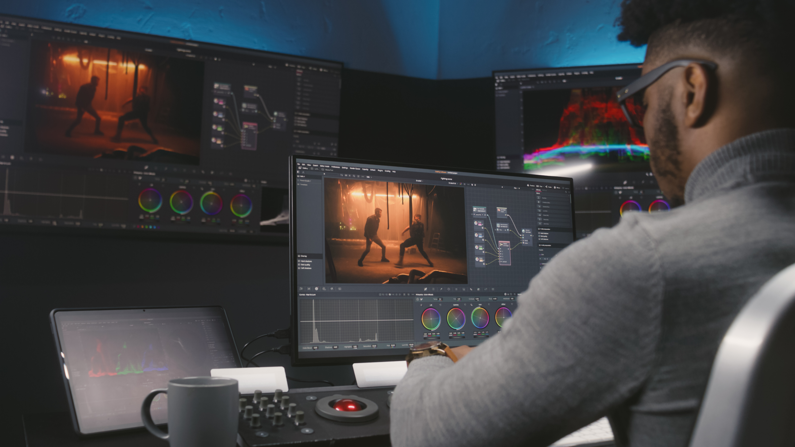

# Personas
## Lisa Ramirez
Lisa Ramirez, a YouTube content creator that wishes to post videos of her everyday tasks with
a twist. She wants it to be creative, colorful and not conventional.
- Lisa is an accountant
- lives alone 
- only has a computer meant to run excel and quickbooks
- Her smartphone is her camera.

## Robert Ramizer
- Small Editing Studio artist
- wants to create a multi episodal series in a cartoon style
- has very little experience in drawing. Only from small college classes
- only has a minor in animation design but a major in

## Joe Johnson
- Runs a conspiracy news site
- Wants to create videos of post apocalyptic America using stock footage
- Joe Johnson is a middle aged man with basic computer skills and basic video editing
skills. He runs a website where he records himself reporting news stories and conspiracies.
Every morning, he wakes up, brews coffee, and suits up to go to his basement studio. He is
really worried about his view count and is always looking for new ways to make his content
more spicy in order to generate more clicks and garner more followers.

# Scenarios

## Crunch Time for Robert Ramizer
Robert is on an extreme time crunch trying to produce a hour long episode for the new
Futurama reboot show. The studio ended up adding a new episode to finish the new season but
no work has been done before that. Our tool would be able to drastically speed up animation
design like that where the user would give the AI a prompt or theme to make the video into
which in this case is futurama. Additionally, on other episodes, Robert’s producer told him that
he had to make a few changes on top of all of his other work. Our program here would be able
to process multiple clips simultaneously, furthermore reducing the workload on Robert so he can
fully focus on the plot.

## Apocalypse story for Joe Johnson
Joe wants to make a story about an apocalyptic event occurring in a small town in America. He
has video footage of the area, where drug crime regularly occurs. There are tents and homeless
people on the street, but he feels like this footage is still too boring and tells an overused story.
He wants to modify the footage to add dark skies, buildings on fire, and anything else that
makes the area look like the apocalypse has occurred. As it is, he doesn’t have enough money
to hire a professional to edit all of his footage. If only there were some easy solution to add
these effects to his footage.

## Scenario Cooking video with Lisa Ramirez
Lisa is starting her first video she recorded footage of her making dinner. Her thoughts are for
the video to look like Jello as an interesting first video. Not knowing how to really use her
expensive subscription to premier pro she has given up on that. She decides to see if there is
an AI tool to use.