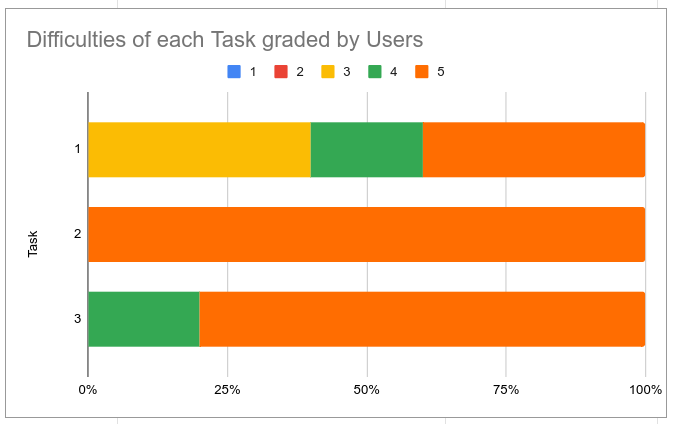

# Phase III: Prototypes and User Testing

[Published Prototype](https://xd.adobe.com/view/003bc7c9-fb75-4bf1-b265-371e61aa8d35-5568/?fullscreen)

[Testing Protocol Script](usability_test_protocol.pdf)

[Data collection spreadsheet](https://docs.google.com/spreadsheets/d/1tReyISG7SlFcwsnA3zvfMGQ7qOGaMCL1CKbJR4K1ou8/edit#gid=0)

<!---
In the dedicated page you should include:

- A summary of the formative feedback/findings you discovered from your heuristic evaluation and cognitive walkthroughs
- A link to the PDF file of your protocol
- A link to your published, interactive prototype (here's instructions for XD Links to an external site.)
- An explanation of each task and each question in your protocol to describe what you hope to discover from it (i.e. which component of UX does it reveal?)
- An explanation of your overall approach to the study (e.g. formative vs summative, think-aloud, experimental, etc)
- A summary of how you would interpret the results of the mock data (as if it was real data). Make sure to make explicit recommendations for how the design can be improved based on those findings.
- A link to a spreadsheet for data collection, with rows filled out representing the mock data collected
- In addition, for this phase you will also finalize the project's overall portfolio. Make sure the main page is formatted correctly and published to GitHub Pages. It should include:
  - the team name, along with a description of the product's purpose,
  - each team member along with their contributions and link their name to their personal UX Journal),
  - Subsection for each of the three deliverables, each with a executive summary that summarizes that deliverable and a link to the dedicated, full deliverable for that phase
--->

## Introduction
<!---
!!! Describe the general problem that the project is trying to solve and the focus of this interval of work !!!
--->
During this sprint, our UX team completed our prototype and were now ready to do Usability Testing on the prototype to see how well our UX design held up. We wanted to find out whether our prototype was easy to use for people with various backgrounds, including people with or without AI experience, and with or without video editing experience. Since the software's goal is to be usable for people with little to no experience as well, we aimed to make the design simple enough that an editing tasks could be complete only using a mouse, and with a minimal number of clicks. After completing the prototype, we aimed to test for efficiency: can a task be completed with a minimal number of steps and clicks, satisfaction: was the user satisfied with the software, and effectiveness: did the user run into any errors, and was there a good success rate for users.
<!---
For the third and final phase of our class and project, we were tasked with conducting Usability tests on other students. We started with designing scenarios in the last two phases that were turned into test tasks for each user. After training and submitting an IRB form, to ensure interviewee safety and proper procedures and protocols are followed, we conducted actual UX tests by employing other students to analyze our prototypes. Using data collected from these interviews, we aim to improve, add, and change features of our application and UI to perfect the main principles of UI: Satisfy, Effective, Efficient, Memorable, Userful, Learnability, Error Tolerant, and Safe.
--->

## Methods
<!---
!!! Describe research methods you used to discover new insights, which explains
the purpose of each. Provide enough detail that someone would be able to
faithfully reproduce your research. !!!
--->
The research method we used during this spring was Usability Testing on human subjects. To start, we filled our an IRB (Institutional Review Board) form, and gave it to our professor to submit to the board to get approval to recruit test subjects and conduct the study.
The IRB form had a few requirements that needed to be included in order to receive approval.

- First, each member of the UX team completed CITI Human Subjects in Research training and earned our certificates.
- Then we designed a [testing protocol script](usability_test_protocol.pdf) that we would be using to test our software with our test subjects. The script included the following:
  - An introduction to describe what the participants would be asked to do and what we were testing for, and informed them that none of their personal data would be retained once the study was completed.
  - Then it asks a few questions about the participants' background in order to find our which category of participant they fall under.
  - Next, it describes three tasks that the participants will try to complete using the prototype. This is the meat of the test, and will show us how efficient, effective, and satisfying the users found the software to be. The three tasks were designed to determine how a user would go about editing a video, including which features they would use, and whether or not they completed the tasks the way that we expected them to. One of the tasks was designed specifically just to see if users would correctly use the "previous videos" feature, which displayed thumbnails of previously unedited and edited videos that the user had used. We also wanted to determine whether our software was designed efficiently, or whether the features of the software needed to be redesigned to reflect better on the mental model that the user had.
      - The first task was an editing task that ask the user to modify a video of two kids play fighting with sticks so that they looked like Star Wars characters with light sabers. We expected the user to use the prompt feature during this task, but also wanted to evaluate it the user could install dependencies easily, and navigate the software easily on their first try.
      - The second task asks the subject to try to find a previous video that they had saved, but did not know the location of the save on their file system, but to do this only using the VidDiffusion prototype. This test was designed to see if the participant could successfully navigate back to the page with the "previous videos" feature, and see if they could naturally discover and use it with minimal effort.
      - The final task asks the participant to upload a new video of their hypothetical dance teacher friend performing a newly choreographed dance, and spice it up by turning her into a pixar character. This task's purpose was to see if the participant could easily discover the "presets" feature, which included drop downs for automatically modifying videos without a prompt, using styles and filters. One of the style presets included a pixar character feature that we hoped the participant would find and use.
  - Finally, the protocol describes a debrief: 5 questions on how the test went, including likes, dislikes, and difficulties the user found with the prototype.

<!---
An explanation of your overall approach to the study (e.g. formative vs summative, think-aloud, experimental, etc) --->

We included the informed consent form, our finalized testing protocol script, our CITI training certificates, our data collection spreadsheet template, and our prototype in our IRB submission.

Once the IRB submission was approved, we started recruiting test subjects. Unfortunately, we could only recruit subjects from a small population: our classmates. The professor provided us with a spreadsheet with time slots where our classmates could sign up to participate in our study, and we were able to recruit five participants (n=5). We then reserved private rooms in the library were we would conduct the study, reserving enough time so that we would have 30 minutes for each participant.

We printed copies of our protocol and consent forms for each participant. Once the study commenced, we began by reading the participant their consent form. We informed them that they can leave at any time, provided them with contact information they can use to contact the research team and then had them sign the consent form. Then we read our study introduction, and ask them to speak their thoughts out loud while they completed each task. We opened the prototype, handed them control, and asked them to complete each task. After each task was complete, we asked them how they thought it went, and to rate the task on a scale from 1 to 5, 5 being easiest. Finally we asked them 5 debrief questions:
- What did they like most about the product?
- What did they dislike most?
- What features did they think might have been missing?
- What features did they have difficulty finding?
- Had they used the preset feature, and, if they did, did they find it to be useful?

The purpose of these questions was to determine whether or not our design targeted the core ideas that make a projects user experience ideal, and to find out how we need to change the software if the users were having a hard time using it.

While recording data, we made sure not to include any personal or identifying information such as names by assigning each user a numerical identifier.

Finally, we thanked them and ended the session.

Once we were finished gathering all the data, we entered it into our spreadsheet for further analysis, and then we handed over all of the consent forms and testing protocols to the professor to shred and dispose of.

The spreadsheet is formatted so that each row contains data for a different participant, and each column represents data for a particular task or question that each participant was subjected to. There is one column for each background question, one column for each task response, and one column for each debrief question. Also, after each task column, there is a completion rating drop down to select how far the participant got into completing the task. The options for completion range through "Failed", "Started", "Halfway", "Almost", and "Success".

## Findings
<!--- !!! Detail each of the findings point-by-point to clarify new
discoveries of users' needs !!!  --->

### Background 1: Has used video editing software:

1 participant had about 4 months of video editing experience.

1 participant had about 6 months of video editing experience.

3 participants had less than 1 month of video editing experience.

Software used:
- vegas pro: 1 participant.
- adobe premiere: 4 participant.
- imovie: 1 participant.
- kinemaster: 1 participant.
- davinci resolve: 2 participant.

All 5 out of 5 of our participants had experience using video editing software. (mean = 1, sd = 0)

2 out of 5 had more than 1 month of experience. (mean = 0.4, sd = 0.49)

1 out of 5 had greater than 5 months of experience. (mean = 0.2,  sd = 0.4)

### Background 2: Has used ai video editing features:
0 out of 5 of our participants had experience using AI tools for video editing. (mean = 0, sd = 0)

All in all, our participants seemed to have similar backgrounds regarding their previous video editing experience, meaning that our data may be skewed one direction or the other for lack of a variety of subjects.

Task1:
- Dependency installation: 3/5 had no difficulty (mean = 0.6, sd = 0.49)
- Used prompt: 4/5 used prompt (mean = 0.8, sd = 0.4)
- Other method: 1/5 used image (mean = 0.2, sd = 0.4)
- Task completion: 5/5 completed the task (mean = 1, sd = 0)
- easy rating: 3/5, 4/5, 5/5, 4/5, 5/5 (mean = 4.2, sd = 0.75)

Task2:
- Navigated back to home: 5/5 (mean = 1, sd = 0)
- Used 'previous videos': 4/5 (mean = 0.8, sd = 0.4)
- Other method: 1/5 used the "choose video" button to navigate file system first. (mean = 0.2, sd = 0.4)
- Task completion: 5/5 (mean = 1, sd = 0)
- easy rating: 5/5, 5/5, 5/5, 5/5, 5/5 (mean = 5, sd = 0)

Task3:
- Uploaded new video and used presets feature: 5/5 (mean = 1, sd = 0)
- Used other method: 0/5
- Task completion: 5/5
- easy rating: 4/5, 5/5, 5/5, 5/5, 5/5 (mean = 4.8, sd = 0.40)

Graph of task difficulty:

## Conclusions
<!--- !!! Discoveries derived from the methods and their findings. Interpret
how the findings translate into new insights into UX design recommendations.
Describe those recommendations and how they should shape future work. In this
section, include the new design recommendations based on the latest user
insights. !!!  --->

### Problems with the prototype UX design.
Overall, the participants seemed to like the layout of the software and thought that it was pretty easy to use. However, there were a few problems that we discovered with our design based on the test results. Furthermore, some of the participants suggested features that they thought would be good to add to make the software more useful.

The first problem we encountered involved the dependency installation portion of the first task. We didn't indicate in the task description that the dependencies needed to be installed in order to see how an unsuspecting user might do when first encountering the software. In the prototype, we included screens for the case when the software dependencies are not fully installed yet, and created a clickable toast message at the top of the screen on the home page. All of the buttons on the screen are grayed out and not clickable until the toast message is clicked, and the dependencies are installed, at which point the software will redirect to a usable home screen. 2 of the participants had trouble figuring out what to do, and took a relatively long time to discover the toast message. Since this is about 40% of our sample, we concluded that the toast message was not a good enough indicator that the dependencies are needed, and decided that in the future we need to better way of indicating this. Based on the user feedback, we think that maybe a large popup in the center of the screen would be more ideal, so that the user cannot miss it and knows exactly what to do.

The next large problem was the layout of the edit completed page. There are two smaller "Save" and "Remove Video" buttons below the original video output on the bottom left hand side of the screen. On the bottom right, there is a large, obvious  "Home" button, and on the top left, there is an arrow button indicating it will return the user to the previous editing page. 3 of the participants expressed concern about whether or not to press save, and lack of understanding of what the software would do if the "Home" or "Back" buttons were pressed without clicking the save button. The prototype gives no warning if the user navigated away from the page without saving, and no indication whether the video has automatically been saved. We have concluded that since 60% of our participants were confused by this, that we need to either include a "video not saved warning" when a navigation button is clicked, or have an autosave function, with some sort of popup indicator or file system sidebar to inform the user that the video is saved, and where they can locate the video.

One more problem we encountered was that one participant mentioned that he could not figure out what the "Remove Video" button was supposed to be used for. We originally came up with this concept as a feature to delete the video if the user did not like the outcome, but it's location and size do not help the user understand really what it is for, and it does not make sense to have if the auto-save feature is not implemented. When the software gets more fleshed out, we will need to decide whether to keep that button, and make it's usage more obvious, or to get rid of it in favor of a more streamlined experience.

One participant found the "previous renders" feature on the home page, but first clicked on "choose from files" button to navigate through the file system. We may have to include a feature that opens up a file navigation screen that lists where each file is stored.

### Recommended features.

A few recommendations were made by some of the participants.

One participant mentioned that he would like to see a feature that would allow users to save their prompts as presets. I thought this was an extremely good idea, because sometimes the AI needs extensive and complicated prompts in order to get it to render the specific feature you want in the video. For users who want to use the same edit on multiple different projects or videos, this would definitely be a killer feature.

Another participant mentioned that he would like a feature for more advanced users, that would allow the users to upload custom training data to affect the way the AI does the edit. As is, our software uses a version of Stable Diffusion that automatically downloads a predetermined training set from huggingface.co. This feature would be great for users that want to do something that our default training data is not well equipped to do.

One participant mentioned he would like to have a side-by-side view of the final video and the original video, with an option to play both simultaneously to compare the changes in real time.

## Caveats
<!--- !!! Considerations and/or limitations to the methods you chose and the
findings/conclusions drawn from them. In other words, give warnings if there
are limitations to your research such as not being able to find enough users of
a particular demographic, the methods not being able to expose certain
information, assumptions you made, etc. !!!  --->
Our created prototypes do not actually represent the functions of all features meaning we had to simulate parts of the tasks as completed by the user. For example, subjects could not actually select a video to upload to the software. Given our project, the major differences between scenarios and tasks is how the user is able to use the finer details of a feature. Having lost out on such control of features, severely reduced the amount of data we were able to collect on each specific feature and its functionality. One feature that was heavily affected was text form in our application that expected users to enter a prompt that the AI would use to edit the video. XD does not allow the tester to actually enter in any text, so they had to say what they wanted to enter, but had no way of knowing its corresponding output using the actual program back end, we were not able to fully simulate if a user is truly able to complete the task without any interference.

Another caveat is that we, although we were able to find real test subjects for our usability test, we were limited to 5 test subjects, and they were all selected from our classmates, so they probably had similar experiences and backgrounds. Due to this small number of participants, if even one participant had difficulty with a particular part of the software, it would be difficult to determine whether this was just an outlier, or if actually 1/5 of user would have difficulty with this feature.

If we had had access to more funds, we may have been able to conduct a higher scale test with more subjects from more varied backgrounds.

