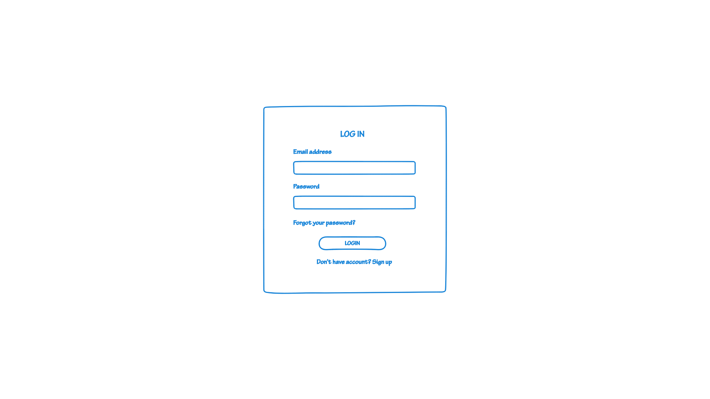
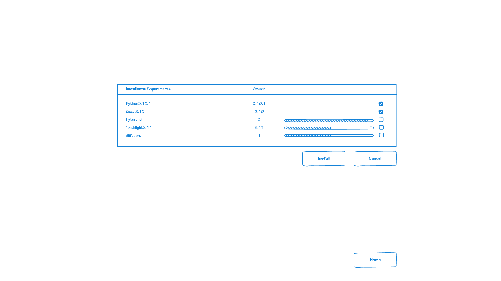
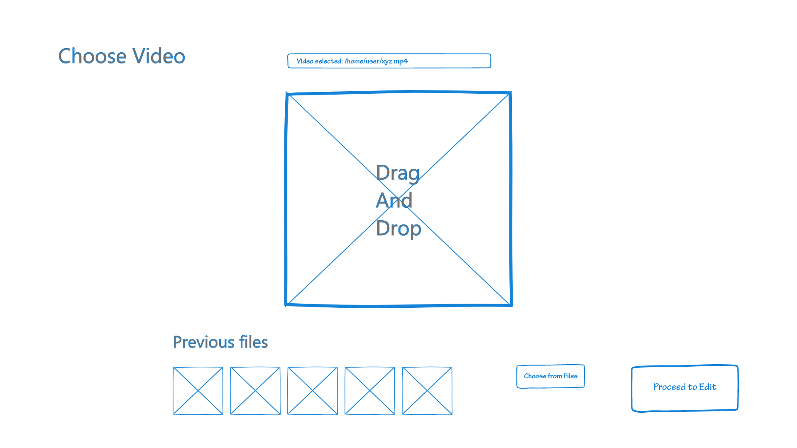
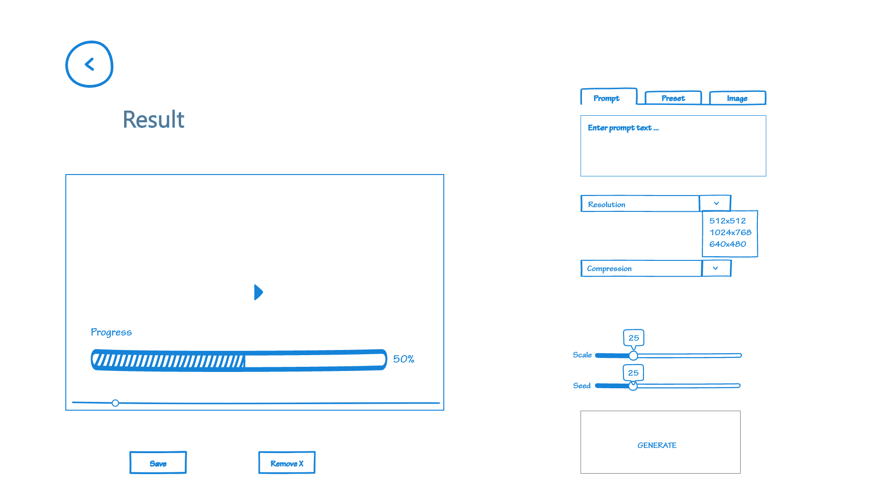
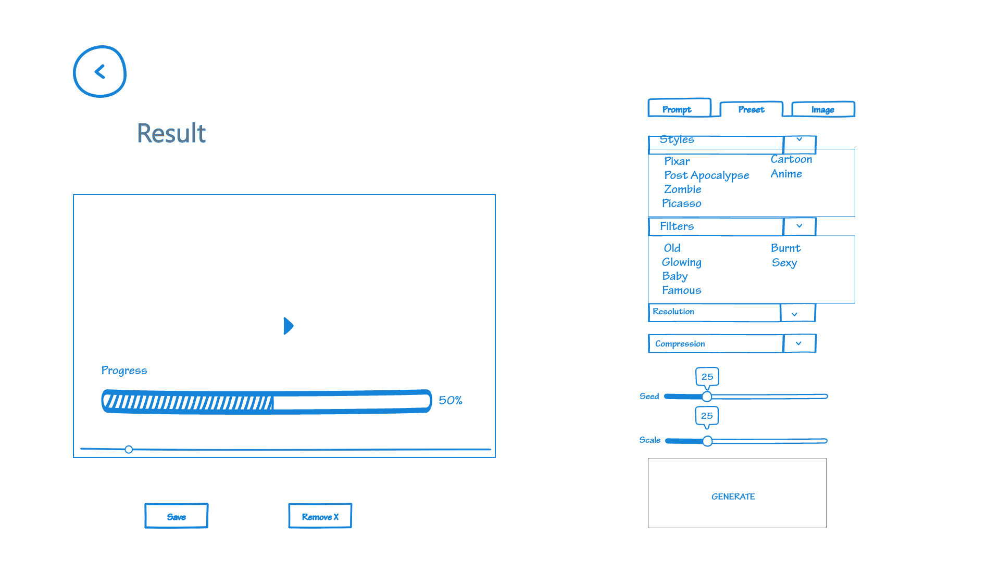
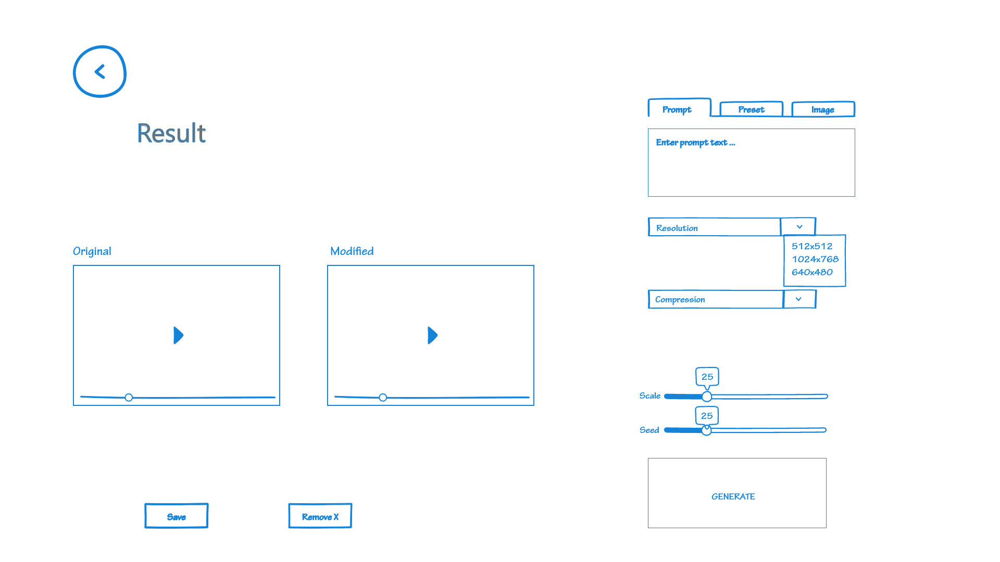

# Persona 3 - Joe Johnson
### Login
- Step 1: Login to sync videos and use the app.

### Install
- Step 2: Install software's dependencies to run the application correctly.

### Upload
- Step 3: Joe needs to upload the video that he wants to convert to a post-apocalyptic scene.

### Edit Video From Prompt
- Step 4: Joe can write a prompt describing his post-apocalyptic scenario or he can proceed to step 5 and select a preset.

### Edit Video from Preset
- Step 5: Joe can select the Post Apocalypse preset from the presets for a quick solution.

### Complete
- Step 6: Joe can review his video to decide if he thinks that it works for his use case. He can save the video or go back and generate a new version.

