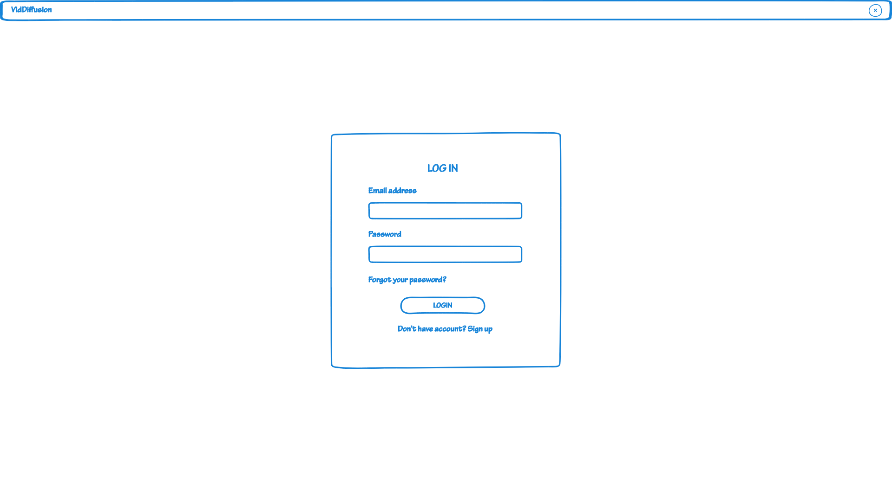

# Persona 1 - Lisa Ramirez
### Login

Lisa needs to login to get the application started. Since she does not have an account she needs to register.
### Register

Here Lisa is prompted to register for an account. She needs to enter her email, username, and password. She also needs to agree to the terms and conditions.
### Install

After sign up is complete she is auto logged in and ready to install the dependencies and the application. The install utility will assist her in doing so.
### Upload

After the install is complete clicking home will launch the homepage that prompts her for a video file. This is where she will upload her video file. This can be done by clicking the upload button or dragging and dropping the file into the upload area.
### Edit Video

In this view Lisa is prompted to select a preset or create a custom prompt, she can select the different parameters that will affect video effect strength and others.
### Edit Results/Post-view

This view allows lisa to view the results of the generated video, she can choose to edit the settings and re-generate the video or save the video to her computer.
### Save Results

Saving the video to file will create a pop-up that will prompt her for location to save to and the various settings for the file quality, format, etc.