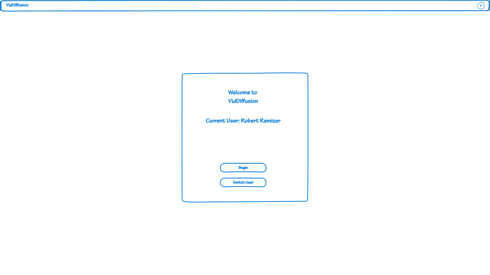
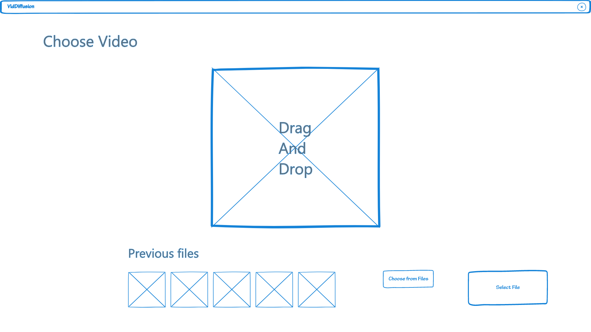
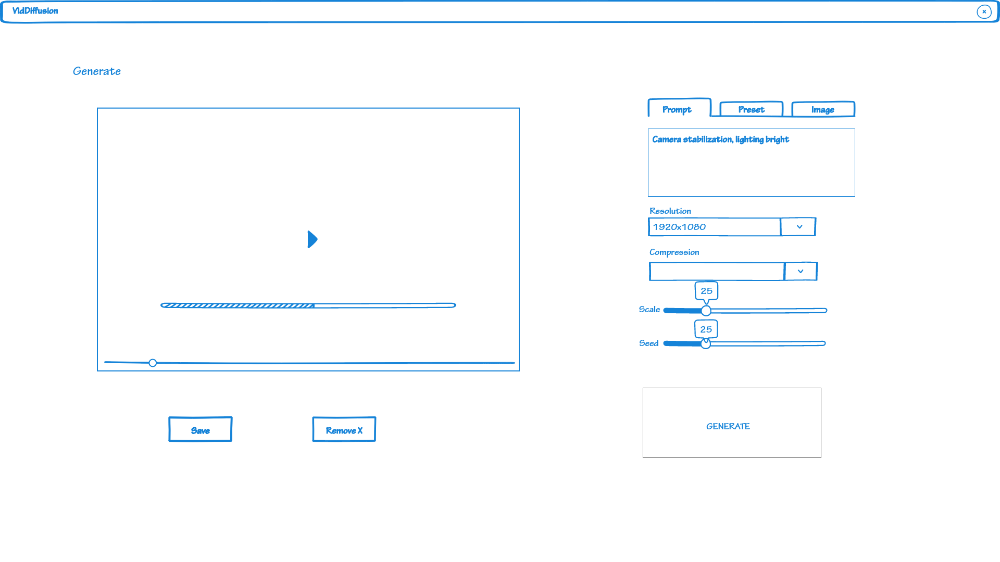
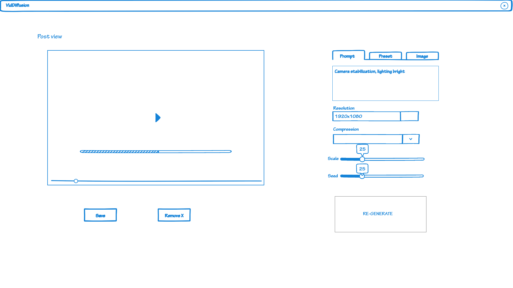
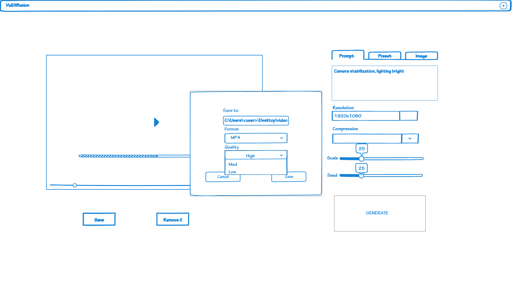

# Persona 2 - Robert Ramizer
### Login
- Step 1: Login is required for all users in order to procede within the app and their goal.
  

### Upload
- Step 2: Robert will upload a video to the website by either drag and drop, or selecting a file from either a file manager or previously viewed files. 

### Edit Video
- Setp 3: Once he uploaded an video to the application he is able to either choose from presets that will modify his video according to his selection. Secondly, he is able to manually type a prompt into the text box, describing what he wants the AI to transform the video into. Or thirdly, he is able to upload a seperate image from which the AI will be able to pull the theme for the video diffusion from. He is ablso able to modify the size of the video.
  

### Edit Results/Post-view
- Step 4: Robert is able to admire what he has created, or if he is not happy with what the AI has produced then he is able to modify the parameter and re-generate the diffusion. 

### Save Results
- Step 5: Lastly, once Robert is happy with what he has modified the video into, he is able to save it to his drive perminantly. Here he can choose what format, quality and name the video will be exported with. 

